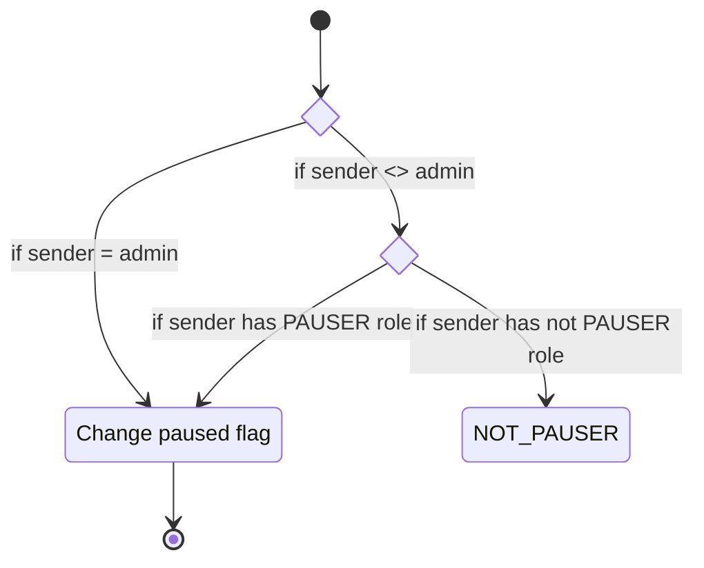
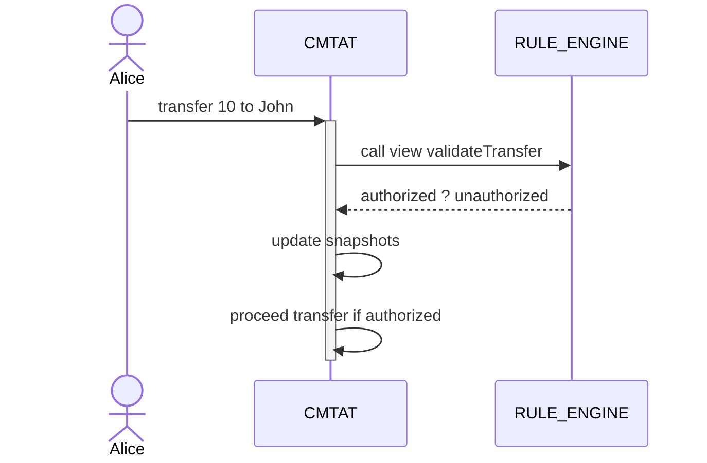

# UNDER CONSTRUCTION !! 
| asset kind   |  progress |
|--------------|-----------|
| single_asset | 90% |
| multi_asset  | 90% |
| nft          | 80% |

PR - rework NFT - In draft ... relevant ? 
- module snapshot for NFT must be reworked
- module totalsupply for NFT must be reworked

- rework error message ? CMTAT_SNAPSHOT_ALREADY_SCHEDULED ....
- rework interface ? burn_param ... 

Other considerations

- should the authorization module take the token_id into account ? a different minter per token_id in a multi asset configuration

- should the snapshot module update snapshot balance in beforeHookTransfer ? (or afterhooktransfer)


# CMTA Token

This repository is an implementation in cameligo of a CMTA token described by the [specifications](https://cmta.ch/content/15de282276334fc837b9687a13726ab9/cmtat-functional-specifications-jan-2022-final.pdf).

It includes features from the basic token standard (TZIP12) and extra features for managing the total supply, for providing snapshots, and granting authorization to other users.

This implementation is architectured as a library which can be used to create a CMTA token. 
This library is extendable which means that when creating a CMTA token, it is possible to override features and to extend the storage with extra fields. These extra features can rely on extra fields in the storage and thus allow to create custom token with CMTA features and additionnal custom features.

This library relies on the `@ligo/fa` library which implements the TZIP-12 standard features and provides an implementation for fungible single-asset, fungible multi-asset , and non-fungible token. In the same manner the CMTA Token library also supports these 3 kind of tokens.

## How to use this library

Install the library with ligo CLI (with docker)
```
ligo install cmtat
```
This command will add a dependency in a `ligo.json` file. 

Here is an example of the resulting `ligo.json` file.
```
{ "dependencies": { "cmtat": "^1.0.0" } }
```

Once installed, you can use the cmtat library to create a cmtat token, or design a custom cmtat token by using the modules provided by the library.


## Modules

The CMTAT library provides features separated on modules which can be used in the final token contract. This *Token contract* must declare its entrypoints and can use functions implemented in the CMTAT library.

For example, the declaration of the `mint` entrypoint can rely on the default implementation provided by the library. 

```
#import "@cmtat/lib/main.mligo" "CMTAT"

module Token = CMTAT.CMTAT_SINGLE_ASSET_EXTENDABLE
type storage = unit Token.storage
type ret = unit Token.ret

[@entry]
let mint (p: Token.mint_param) (s: storage) : ret =
  Token.mint p s
```
In the snippet of code (above) the `Token.mint` function contains the default implementation. Notice that this token is a "Single asset" because the `CMTAT.CMTAT_SINGLE_ASSET_EXTENDABLE` module is used. This module also provides an interface (`Token.mint_param`) and a default storage (`Token.storage`).  

## Extendable library

By "extendable" it is meant that the storage can be extended. This module has been designed to allow to add extra field in the storage. The `CMTAT.CMTAT_SINGLE_ASSET_EXTENDABLE` module provides a parametric storage which expects an `extension` custom type.

For example one can define an empty extension by providing a `unit` type
```
type storage = unit Token.storage
```

or add new fields in an "extension" type
```
type extension = {
  issuer : address
}
type storage = extension Token.storage
type ret = extension Token.ret
```

This extendability is essential to allow to anyone to create tokens which inherit from CMTA Token behavior. 

One may want to override the default behavior provided by the `CMTAT.CMTAT_SINGLE_ASSET_EXTENDABLE` module.
Here's a harmless override where the pause entrypoint can only be called by the `issuer` (that we just defined previously int he extension) or the administrator

```
[@entry]
let pause (p : Token.ADMINISTRATION.pause_param) (s : storage) : ret =
  let sender = Tezos.get_sender() in
  let () = assert_with_error ((sender = s.extension.issuer) || (sender = s.administration.admin)) Errors.not_issuer_nor_admin in
  [], { s with administration = Token.ADMINISTRATION.pause p s.administration }
```
Notice that in this snippet of code, we do not use the `Token.pause` function but we use the sub-module `Token.ADMINISTRATION` in order to squizz the default role verification.


## CMTAT modules

### FA2 (TZIP-12 standard)

FA2 basic features (from standard) consists on allowing people to transfer assets between them  

### Total supply

The *Totalsupply* module consists on keep track of the total supply of the token. The total supply represents the total number of assets. It is updated when some assets are minted or burned. 

### Administration

The *Administration* module consists on allowing a special user (administrator) to pause/unpause the contract, and to create assets and to destroy assets. 

The *Administration* module also provide a `kill` function to destroy the contract. Actually the contract still exist but the storage is cleaned and the entrypoints are disabled.


### Authorizations

The *Authorizations* module allows the `administrator` of the token to delegate some of his responsabilities to other trusted persons. It allows to grant administration roles to other trusted user. 

Being granted of a role allows to call specific entrypoints. Here is a list of roles and corresponding entrypoints.

|        Role       |    Entrypoints    |
|-------------------|-------------------|
| PAUSER            | pause |
| MINTER            | mint |
| BURNER            | burn |
| RULER             | grantRole, revokeRole |
| SNAPSHOOTER       | scheduleSnapshot, rescheduleSnapshot, unscheduleSnapshot |
| VALIDATOR         | setRuleEngine |

When calling one of these entrypoints a role verification is performed. The diagram illustrates this verification for the pause entrypoint. 


The role verification is similar for all entrypoints. 

The *Authorizations* module provides two functions (`grantRole`, `revokeRole`) to modify roles for a given user.

The *Authorizations* module also provides a function (`hasRole`) to verify if a given user has a given role .

### Validation

The *Validation* module provides an external mecanism to authorize/unauthorize transfer of asset. 

It is required to be able to prevent the execution of a transfer depending on arbitrary rules (such as specific account can be blacklisted). These rules are externalized in an other contract (called **RuleEngine**). 

The *Validation* module provides a function `validateTransfer` that asks the **RuleEngine** contract if a transfer is allowed. This function is called during a `Transfer` (in the [implementation](./lib/cmtat/extendable_cmtat_single_asset.impl.mligo) of `transfer` function in the CMTAT library). 

The *Validation* module provides a function `setRuleEngine` that modifies the **RuleEngine** contract that is used to unauthorize a transfer. This function expects the `address` of the new **RuleEngine** contract. This function is only callable by the administrator of the token.

A example of **RuleEngine** contract is provided in the `test` directory. This [example contract](./test/helpers/rule_engine_contract.mligo) implements a naive blacklist and verifies that a given transaction does not involve blcklisted addresses.
A RuleEngine contract must have an on-chain view with the following signature:
```
let validateTransfer (from_, to_, _amount_ : address * address * nat) (s : storage) : bool =
```

In the case a **RuleEngine** has been defined, the validation workflow of a `transfer` involves a RuleEngine contract.


### Snapshots

The *Snapshots* module keeps track of total supply and account balance at certain point in time.


The *Snapshots* module provides the `scheduleSnapshot` function which allows to schedule snapshots (in the future).  
When the Transfer entrypoint (or Mint Burn) is called it updates the total supply and account balances inside the current snapshot. 
TODO  ==== This update is done before the execution of the transfer, thus snapshots represents the balance before the transfer is done.

The *Snapshots* module provides the `rescheduleSnapshot` function to modify when a snapshot is scheduled (the scheduled snapshots cannot be re-ordered).

The *Snapshots* module provides the `unscheduleSnapshot` function to cancel the last scheduled snapshot.

The *Snapshots* module provides a view `getNextSnapshots` to retrieve the existing scheduled snapshot times (ones not yet done). So the first one is the current snapshot.

The *Snapshots* module also provides views (`snapshotTotalsupply`, `snapshotBalanceOf`)to query the total supply and account balances for a given snapshot time.


## Library functions

Functions provided by the library for Single asset configuration.

| function name           | parameter                                    |  module                   |
|-------------------------|----------------------------------------------|---------------------------|
| pause                   | bool                                         | ADMINISTRATION            |
| transfer                | FA2.SingleAssetExtendable.TZIP12.transfer    | FA2.SingleAssetExtendable |
| balance_of              | FA2.SingleAssetExtendable.TZIP12.balance_of  | FA2.SingleAssetExtendable |
| update_operators        | FA2.SingleAssetExtendable.TZIP12.update_operators | FA2.SingleAssetExtendable |
| mint                    | mint_param                                   | FA2.SingleAssetExtendable |
| burn                    | burn_param                                   | FA2.SingleAssetExtendable |
| kill                    | unit                                         | ADMINISTRATION            |
| grantRole               | address * AUTHORIZATIONS.role                | AUTHORIZATIONS            |
| revokeRole              | address * AUTHORIZATIONS.role                | AUTHORIZATIONS            |
| scheduleSnapshot        | timestamp                                    | SNAPSHOTS                 |
| rescheduleSnapshot      | timestamp * timestamp                        | SNAPSHOTS                 |
| unscheduleSnapshot      | timestamp                                    | SNAPSHOTS                 |
| setRuleEngine           | address option                               | VALIDATION                |
| validateTransfer        | address * address * nat                      | VALIDATION                |
| assert_validateTransfer | TZIP12.transfer                              | VALIDATION                |


## Library Views

| view name           | parameter                                 | returned type  | module                    |
|---------------------|-------------------------------------------|----------------|---------------------------|
| get_balance         | address * nat                             | nat            | FA2.SingleAssetExtendable |
| total_supply        | nat                                       | nat            | FA2.SingleAssetExtendable |
| all_tokens          | unit                                      | nat set        | FA2.SingleAssetExtendable |
| is_operator         | FA2.SingleAssetExtendable.TZIP12.operator | bool           | FA2.SingleAssetExtendable |
| token_metadata      | nat                                       | FA2.SingleAssetExtendable.TZIP12.tokenMetadataData  | FA2.SingleAssetExtendable |
| hasRole             | address * AUTHORIZATIONS.role             | bool           | AUTHORIZATIONS            |
| getNextSnapshots    | unit                                      | timestamp list | SNAPSHOTS                 |
| snapshotTotalsupply | timestamp * nat                           | nat            | SNAPSHOTS                 |
| snapshotBalanceOf   | timestamp * address * nat                 | nat            | SNAPSHOTS                 |


## Tests

An exemple of CMTA Token contract has been implemented for testing purposes. This [extended_cmtat_single_asset](./test/cmtat/extended_cmtat_single_asset.instance.mligo) illustrates 
- how to implement a token contract based on cmtat library 
- how to define entrypoints using the default behavior
- how to customize the storage of the token contract
- how to customize entrypoints while reusing sub-modules of the library

This token contract is used to originate a contract instance and to run test on related entrypoints. [Tests](./test/cmtat/extended_cmtat_single_asset.test.mligo) of the **extended_cmtat_single_asset** contract illusrates how to execute entrypoints in predefined conditions and how to verify execution termination (success and failures).

These tests also ensures that the default implementation provided by the library is doing what is expected of it !

To run these tests, run the following commands
```
git clone https://github.com/ligolang/CMTAT-Ligo.git
cd CMTAT-Ligo
make install
make test
```

To run test only one file. The SUITE env var can be set to point the test file. 
For example, for the basic FA2 tests for a multi asset `SUITE=cmtat/SUITE=cmtat/extended_cmtat_multi_asset.fa2` points to `./test/cmtat/SUITE=cmtat/extended_cmtat_multi_asset.fa2.test.mligo`
```
make test SUITE=cmtat/extended_cmtat_multi_asset.fa2
```

To run tests on CMTAT features for a multi asset
```
make test SUITE=cmtat/extended_cmtat_multi_asset
```

To run tests on CMTAT features for a single asset
```
make test SUITE=cmtat/extended_cmtat_single_asset
```

To run tests on FA2 features for a single asset
```
make test SUITE=cmtat/extended_cmtat_single_asset.fa2
```

To run tests on CMTAT features for a NFT
```
make test SUITE=cmtat/extended_cmtat_nft_asset
```